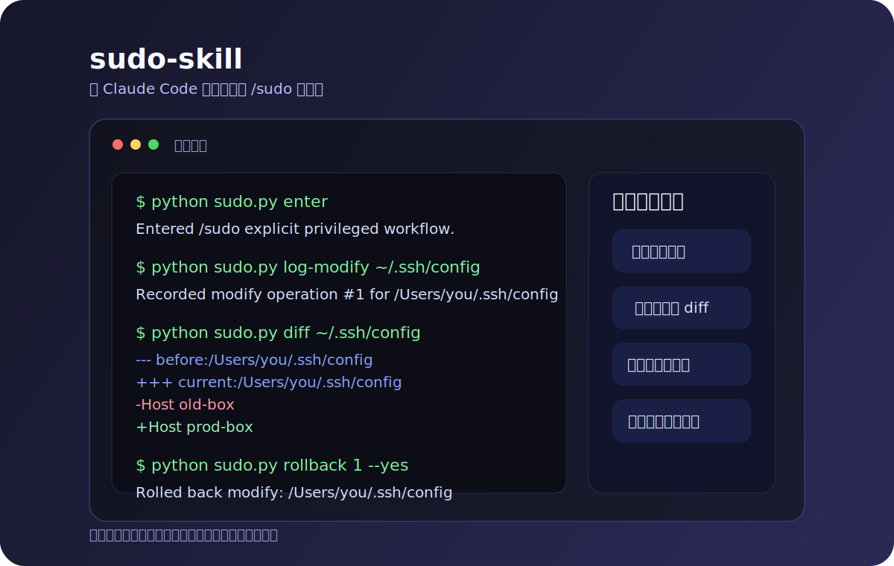

# sudo-skill

[](https://github.com/kelin3296-jpg/sudo-skill/actions/workflows/ci.yml)


给 Claude Code 用的更稳妥 `/sudo` 工作流：先备份、再修改；先看 diff、再回滚；把特权模式后的后顾之忧，变成一条可追溯、可兜底的回退路径。

英文说明见 [`README.en.md`](README.en.md)。参与贡献先看 [`CONTRIBUTING.md`](CONTRIBUTING.md)，版本历史见 [`CHANGELOG.md`](CHANGELOG.md)。



## 这个项目为什么存在

真正让人紧张的，往往不是敲下特权命令本身，而是命令执行之后那种不确定感：

- “如果这次改坏了，我怎么撤回来？”
- “如果我动的是敏感路径，出了问题还能不能清楚地恢复？”
- “用了 `/sudo` 这种心智模型，会不会把后续善后成本都转嫁给自己？”

`sudo-skill` 就是为了解决这种心理负担。它保留大家熟悉的 `/sudo` 使用习惯，但把它变成一个**显式、可审计、可回滚**的流程：有备份、有日志、有 diff、有对象校验后的安全回滚。

## 它解决的痛点

- 特权修改一旦缺少回退方案，用户会天然紧张
- shell history 不是可靠的 rollback 方案
- 敏感文件、系统路径和权限改动，需要“先有兜底，再敢动手”
- `/sudo` 带来的压力，本质上是“改完以后怎么办”的焦虑

## sudo-skill 能帮你做什么

- **显式特权工作流**：`/sudo` 表示进入受跟踪流程，不是偷偷绕过沙箱
- **修改前先备份**：真正高风险的改动先留后手
- **回滚前先看 diff**：先判断，再撤回
- **安全回滚**：对象不一致时拒绝 destructive rollback
- **日志和备份兜底**：`~/.claude` 下保留可追查的恢复线索

## 出问题时的兜底方案

如果某次敏感修改让你不放心，兜底方案不是“回忆刚刚改了什么”，而是：

1. 先看 `/sudo diff`
2. 再查 `/sudo history`
3. 对最新仍然活跃的变更执行回滚，前提是对象校验仍然匹配
4. 必要时去 `~/.claude/sudo-backups/` 和 `~/.claude/sudo-logs/` 做人工排查与恢复

这个 skill 最重要的价值，就是让用户在进入特权模式时，不再因为“万一出错怎么办”而有明显后顾之忧。

## 30 秒安装

### 最省事的方式：把这段提示词直接发给 Claude Code

```text
请帮我从这个 GitHub 仓库安装 `sudo-skill`：
https://github.com/kelin3296-jpg/sudo-skill

要求：
1. 下载最新 GitHub Release 里的 `sudo-skill.zip`
2. 安装到 `~/.claude/skills/sudo`
3. 如果 `~/.claude/skills/sudo` 已经存在，先备份旧目录，再覆盖安装
4. 安装完成后运行 `python3 ~/.claude/skills/sudo/sudo.py status`
5. 最后告诉我 `/sudo`、`/sudo diff`、`/sudo history 5`、`/sudo rollback 1 --yes` 分别怎么用
6. 如果 Release 资产不可用，就退回到仓库内容安装，并明确告诉我你实际用了哪种安装路径
```

### 适合直接转发给朋友的话术

```text
我最近在用一个 Claude Code 的 `/sudo` 安装包，适合那种要改敏感文件、系统路径，但又担心改坏之后不好撤回的场景。

你直接把下面这段发给 Claude Code 就行：

请帮我安装这个 GitHub 项目里的 `sudo-skill`：
https://github.com/kelin3296-jpg/sudo-skill

要求：
1. 优先下载最新 Release 里的 `sudo-skill.zip`
2. 安装到 `~/.claude/skills/sudo`
3. 如果已有旧目录，先备份再覆盖
4. 安装后运行 `python3 ~/.claude/skills/sudo/sudo.py status` 检查是否正常
5. 再告诉我 `/sudo`、`/sudo diff`、`/sudo history 5`、`/sudo rollback 1 --yes` 怎么用
6. 如果 Release 资产不可用，就直接从仓库内容安装，并说明你用了哪种方式

这个 skill 的作用是：先备份、再修改；先看 diff、再回滚。这样就算进了特权模式，后面也还有日志、备份和回滚这条兜底路径。
```

### 手动安装兜底命令

```bash
mkdir -p ~/.claude/skills
curl -L -o /tmp/sudo-skill.zip \
  https://github.com/kelin3296-jpg/sudo-skill/releases/latest/download/sudo-skill.zip

tmp_dir=$(mktemp -d)
unzip /tmp/sudo-skill.zip -d "$tmp_dir"

if [ -d ~/.claude/skills/sudo ]; then
  mv ~/.claude/skills/sudo ~/.claude/skills/sudo.bak.$(date +%Y%m%d%H%M%S)
fi

mv "$tmp_dir"/sudo-skill ~/.claude/skills/sudo
python3 ~/.claude/skills/sudo/sudo.py status
```

## 快速开始

```bash
python sudo.py enter
python sudo.py log-modify ~/.ssh/config
# 编辑文件
python sudo.py finalize-modify ~/.ssh/config
python sudo.py diff ~/.ssh/config
python sudo.py rollback 1 --yes
python sudo.py exit
```

## 面向用户的公开命令

```bash
python sudo.py enter
python sudo.py exit
python sudo.py status
python sudo.py clean --days 7
python sudo.py purge --yes
python sudo.py history 20
python sudo.py rollback 1 --yes
python sudo.py diff [路径|历史序号]
```

## 供 skill / 集成层使用的记录命令

为了保持 `operation_logger.py` 是内部模块，对外只暴露 `sudo.py`：

```bash
python sudo.py log-modify <path>
python sudo.py finalize-modify <path> [--id OP_ID]
python sudo.py log-delete <path>
python sudo.py log-create <path>
python sudo.py log-move <src> <dst>
python sudo.py log-chmod <path> <旧权限八进制> <新权限八进制>
```

## 默认存储位置

默认写到 `~/.claude`：

- `~/.claude/sudo-backups/`
- `~/.claude/sudo-logs/`
- `~/.claude/sudo-state.json`

开发、测试或自定义安装时，可通过 `SUDO_SKILL_HOME` 覆盖。

## 风险说明

- 这个 skill **不会自动修改 Claude Code 的 bash 参数**。
- 如果当前文件对象与记录时不一致，回滚会拒绝执行 destructive 操作。
- 删除回滚不会覆盖后来占用了原路径的新文件。
- 创建回滚不会删除创建后又被改过的文件。

## 终端演示流程

```text
$ python sudo.py enter
Entered /sudo explicit privileged workflow.

$ python sudo.py log-modify ~/.ssh/config
Recorded modify operation #1 for /Users/you/.ssh/config

$ python sudo.py finalize-modify ~/.ssh/config
Finalized modify operation #1 for /Users/you/.ssh/config

$ python sudo.py diff ~/.ssh/config
--- before:/Users/you/.ssh/config
+++ current:/Users/you/.ssh/config
@@ ...

$ python sudo.py rollback 1 --yes
Rolled back modify: /Users/you/.ssh/config

$ python sudo.py exit
Exited /sudo workflow.
```

## 仓库文档入口

- 贡献说明：[`CONTRIBUTING.md`](CONTRIBUTING.md)
- 版本历史：[`CHANGELOG.md`](CHANGELOG.md)
- 安全策略：[`SECURITY.md`](SECURITY.md)
- 支持说明：[`SUPPORT.md`](SUPPORT.md)
- Bug 反馈：GitHub issue 模板
- 功能建议：GitHub issue 模板
- Pull request：GitHub PR 模板

## 开发与发布

```bash
python3 -m venv .venv
./.venv/bin/pip install pytest
./.venv/bin/python -m pytest
python3 scripts/build_release.py
```

发布脚本会生成 `dist/sudo-skill.zip`，并自动排除 `__MACOSX`、测试文件和缓存目录。

推送像 `v0.1.4` 这样的 tag 时，`.github/workflows/release.yml` 会自动跑测试、构建 zip，并发布结构化的 GitHub Release 说明。
